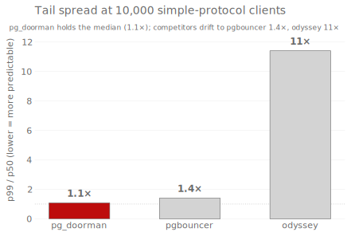
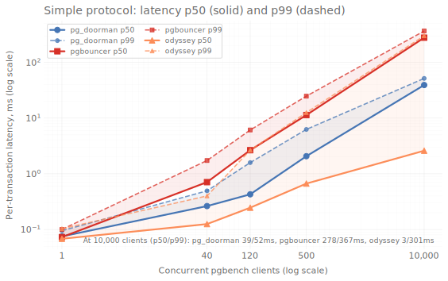
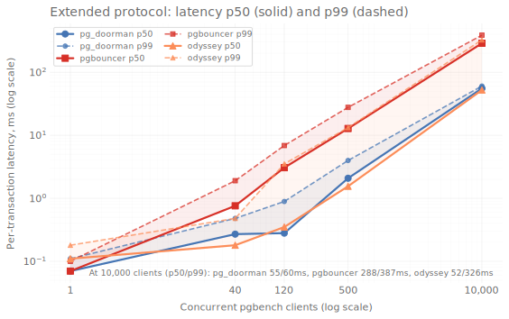
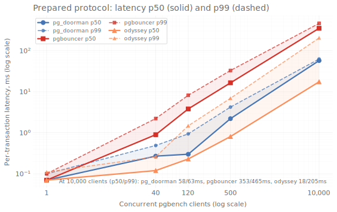

# Benchmarks

Three connection poolers — pg_doorman, pgbouncer, odyssey — driven
by `pgbench` against the same PostgreSQL backend on identical
hardware. Numbers below are relative throughput against each
competitor and absolute per-transaction latency.

_Last updated: 2026-05-07 13:25 UTC._

## TL;DR

- **vs pgbouncer** — pg_doorman peaks at **x9.7** TPS on prepared protocol, 500 clients.
- **vs odyssey** — pg_doorman peaks at **x1.5** TPS on extended protocol, 10,000 clients.
- **Tail spread at 10 000 simple-protocol clients** (`p99/p50`, lower = more predictable) — pg_doorman 1.3× (39.2→51.6ms), pgbouncer 1.3× (278→367ms), odyssey 116× (2.60→301ms).

### Environment

- **Provider**: Ubicloud `standard-30` (eu-central-h1)
- **Resources**: 30 vCPU / 117.9 GB
- **Kernel**: `Linux 5.15.0-139-generic x86_64`
- **Versions**: PostgreSQL 14.22, pg_doorman 3.8.0, pgbouncer 1.25.1, odyssey 1.4.1
- **Workers**: pg_doorman: 15, odyssey: 15
- **Duration per pgbench run**: 30s
- **Started**: 2026-05-07 11:39 UTC
- **Finished**: 2026-05-07 13:21 UTC
- **Total wall-clock**: 1h 42m 14s
- **Commit**: [`955a7402`](https://github.com/ozontech/pg_doorman/commit/955a7402701cb061123368e3afde09688ff6390f)

### Methodology

Each scenario runs `pgbench -T <duration>` against a 40-connection
server-side pool (`pool_mode = transaction`). The workload is a single
`SELECT :aid` (`\set aid random(1, 100000)`) — pure pooler overhead, no
real working set. Three poolers, one PostgreSQL backend, identical
hardware.

- **Reconnect** rows use `pgbench --connect`: a fresh TCP+startup per
  transaction (worst case for login latency).
- **SSL** rows set `PGSSLMODE=require` and a self-signed cert.
- Latency is collected with `pgbench --log` (per-transaction file);
  percentiles come from those samples, not from `pgbench` summary stats.
- Scenarios run sequentially with the same data dir and warm OS caches.

Source: [`tests/bdd/features/bench.feature`](https://github.com/ozontech/pg_doorman/blob/master/tests/bdd/features/bench.feature),
driver: [`benches/setup-and-run-bench.sh`](https://github.com/ozontech/pg_doorman/blob/master/benches/setup-and-run-bench.sh).

### Reading the tables

**Throughput** — `pg_doorman_TPS / competitor_TPS`, rendered:

| Value | Meaning |
|-------|---------|
| +N% / -N% | Faster / slower by N percent |
| ≈0% | Within 3% — call it a tie |
| xN.N | N times faster (when ratio ≥ 1.5) |
| ∞ | Competitor returned 0 TPS |
| N/A | Competitor was not measured for this row |
| - | Not measured for either pooler |

**Latency** — per-transaction in ms. Each row shows `p50 / p99` for
every pooler plus the **spread** (`p99 / p50`): how far the slowest 1%
drifts from the median. `1.0×` means the tail equals the median;
`100×` means the worst 1% takes two orders of magnitude longer than a
typical request — the regime where fanout latency starts hitting users
([Dean & Barroso, 2013](https://www.barroso.org/publications/TheTailAtScale.pdf)).
Watch the spread column to see whether tail latency stays bounded as
the client count grows. Full p95 series ships in the raw
`pgbench --log` files in the artifact tarball.

---

## Simple protocol

### Throughput

| Test | vs pgbouncer | vs odyssey |
|------|--------------|------------|
| 1 client | -3% | -9% |
| 40 clients | x2.9 | -42% |
| 120 clients | x6.0 | -24% |
| 500 clients | x6.7 | -11% |
| 10,000 clients | x6.9 | +10% |
| 1 client + Reconnect | ≈0% | x2.3 |
| 40 clients + Reconnect | x2.1 | x1.7 |
| 120 clients + Reconnect | x2.2 | N/A |
| 500 clients + Reconnect | x2.3 | N/A |
| 10,000 clients + Reconnect | x1.9 | N/A |
| 1 client + SSL | -7% | -6% |
| 40 clients + SSL | x3.0 | -39% |
| 120 clients + SSL | x7.1 | -29% |
| 500 clients + SSL | x7.7 | -20% |
| 10,000 clients + SSL | x8.3 | +19% |
| 1 client + SSL + Reconnect | -52% | +11% |
| 40 clients + SSL + Reconnect | ≈0% | -15% |
| 120 clients + SSL + Reconnect | +13% | -15% |
| 500 clients + SSL + Reconnect | +10% | -7% |
| 10,000 clients + SSL + Reconnect | +10% | ≈0% |

### Latency (ms; spread = p99 / p50)

| Test | pg_doorman p50/p99 | spread | pgbouncer p50/p99 | spread | odyssey p50/p99 | spread |
|------|-------------------:|-------:|------------------:|-------:|----------------:|-------:|
| 1 client | 0.07 / 0.10 | 1.3× | 0.07 / 0.10 | 1.4× | 0.07 / 0.10 | 1.5× |
| 40 clients | 0.26 / 0.49 | 1.9× | 0.71 / 1.73 | 2.4× | 0.12 / 0.40 | 3.2× |
| 120 clients | 0.43 / 1.59 | 3.7× | 2.65 / 6.11 | 2.3× | 0.25 / 2.66 | 11× |
| 500 clients | 2.07 / 6.26 | 3.0× | 11.3 / 24.8 | 2.2× | 0.67 / 12.6 | 19× |
| 10,000 clients | 39.2 / 51.6 | 1.3× | 278 / 367 | 1.3× | 2.60 / 301 | 116× |
| 1 client + Reconnect | 0.08 / 0.14 | 1.7× | 0.11 / 0.19 | 1.6× | 0.18 / 0.35 | 1.9× |
| 40 clients + Reconnect | 1.03 / 2.78 | 2.7× | 2.05 / 5.96 | 2.9× | 1.70 / 5.24 | 3.1× |
| 120 clients + Reconnect | 3.16 / 7.71 | 2.4× | 6.55 / 17.6 | 2.7× | 5.30 / 13.6 | 2.6× |
| 500 clients + Reconnect | 13.5 / 31.2 | 2.3× | 29.8 / 68.0 | 2.3× | 24.3 / 64.5 | 2.7× |
| 10,000 clients + Reconnect | 291 / 568 | 2.0× | 551 / 1169 | 2.1× | 859 / 1652 | 1.9× |
| 1 client + SSL | 0.08 / 0.11 | 1.3× | 0.08 / 0.12 | 1.5× | 0.07 / 0.12 | 1.7× |
| 40 clients + SSL | 0.28 / 0.62 | 2.2× | 0.84 / 1.94 | 2.3× | 0.13 / 0.60 | 4.5× |
| 120 clients + SSL | 0.47 / 1.93 | 4.1× | 3.37 / 7.77 | 2.3× | 0.26 / 3.79 | 15× |
| 500 clients + SSL | 1.69 / 10.7 | 6.3× | 15.7 / 31.5 | 2.0× | 0.68 / 13.7 | 20× |
| 10,000 clients + SSL | 35.8 / 64.2 | 1.8× | 373 / 526 | 1.4× | 7.26 / 351 | 48× |
| 1 client + SSL + Reconnect | 0.33 / 0.40 | 1.2× | 0.14 / 0.37 | 2.7× | 0.29 / 0.45 | 1.6× |
| 40 clients + SSL + Reconnect | 19.0 / 40.3 | 2.1× | 18.2 / 54.3 | 3.0× | 15.6 / 36.4 | 2.3× |
| 120 clients + SSL + Reconnect | 57.6 / 123 | 2.1× | 63.6 / 153 | 2.4× | 48.3 / 110 | 2.3× |
| 500 clients + SSL + Reconnect | 231 / 483 | 2.1× | 250 / 557 | 2.2× | 218 / 454 | 2.1× |
| 10,000 clients + SSL + Reconnect | 4277 / 9052 | 2.1× | 4938 / 9878 | 2.0× | 4254 / 8958 | 2.1× |

---

## Extended protocol

### Throughput

| Test | vs pgbouncer | vs odyssey |
|------|--------------|------------|
| 1 client | +7% | x1.6 |
| 40 clients | x3.0 | -4% |
| 120 clients | x6.1 | -9% |
| 500 clients | x7.1 | +31% |
| 10,000 clients | x6.9 | x1.5 |
| 1 client + Reconnect | -13% | x2.4 |
| 40 clients + Reconnect | x2.2 | N/A |
| 120 clients + Reconnect | x2.4 | N/A |
| 500 clients + Reconnect | x2.2 | N/A |
| 10,000 clients + Reconnect | x2.0 | x3.0 |
| 1 client + SSL | +5% | +46% |
| 40 clients + SSL | x2.9 | -17% |
| 120 clients + SSL | x6.3 | ≈0% |
| 500 clients + SSL | x7.7 | +29% |
| 10,000 clients + SSL | x8.0 | x1.8 |

### Latency (ms; spread = p99 / p50)

| Test | pg_doorman p50/p99 | spread | pgbouncer p50/p99 | spread | odyssey p50/p99 | spread |
|------|-------------------:|-------:|------------------:|-------:|----------------:|-------:|
| 1 client | 0.07 / 0.09 | 1.3× | 0.07 / 0.10 | 1.4× | 0.11 / 0.17 | 1.6× |
| 40 clients | 0.26 / 0.51 | 1.9× | 0.73 / 1.80 | 2.5× | 0.21 / 0.69 | 3.3× |
| 120 clients | 0.44 / 1.65 | 3.8× | 2.75 / 6.35 | 2.3× | 0.41 / 1.77 | 4.3× |
| 500 clients | 2.13 / 6.05 | 2.8× | 11.9 / 25.5 | 2.1× | 0.81 / 19.3 | 24× |
| 10,000 clients | 39.7 / 58.4 | 1.5× | 285 / 404 | 1.4× | 5.35 / 432 | 81× |
| 1 client + Reconnect | 0.14 / 0.21 | 1.5× | 0.13 / 0.20 | 1.5× | 0.32 / 0.48 | 1.5× |
| 40 clients + Reconnect | 1.04 / 2.69 | 2.6× | 2.16 / 5.97 | 2.8× | 1.68 / 5.25 | 3.1× |
| 120 clients + Reconnect | 3.17 / 7.70 | 2.4× | 7.32 / 18.3 | 2.5× | 5.43 / 16.0 | 2.9× |
| 500 clients + Reconnect | 13.5 / 31.6 | 2.3× | 27.8 / 67.7 | 2.4× | 25.3 / 69.1 | 2.7× |
| 10,000 clients + Reconnect | 291 / 569 | 2.0× | 571 / 1212 | 2.1× | 871 / 1692 | 1.9× |
| 1 client + SSL | 0.08 / 0.10 | 1.2× | 0.08 / 0.12 | 1.5× | 0.12 / 0.19 | 1.6× |
| 40 clients + SSL | 0.28 / 0.65 | 2.3× | 0.85 / 1.75 | 2.1× | 0.20 / 0.73 | 3.6× |
| 120 clients + SSL | 0.52 / 2.07 | 4.0× | 3.32 / 7.75 | 2.3× | 0.45 / 4.17 | 9.3× |
| 500 clients + SSL | 1.70 / 11.4 | 6.7× | 17.0 / 32.8 | 1.9× | 0.99 / 22.9 | 23× |
| 10,000 clients + SSL | 39.2 / 66.7 | 1.7× | 372 / 615 | 1.7× | 78.1 / 498 | 6.4× |

---

## Prepared protocol

### Throughput

| Test | vs pgbouncer | vs odyssey |
|------|--------------|------------|
| 1 client | ≈0% | -13% |
| 40 clients | x3.5 | -40% |
| 120 clients | x8.0 | -35% |
| 500 clients | x9.7 | -13% |
| 10,000 clients | x8.8 | +7% |
| 1 client + Reconnect | -8% | x2.1 |
| 40 clients + Reconnect | x1.9 | N/A |
| 120 clients + Reconnect | x2.0 | x1.6 |
| 500 clients + Reconnect | x2.2 | N/A |
| 10,000 clients + Reconnect | x2.0 | x2.9 |
| 1 client + SSL | -3% | ≈0% |
| 40 clients + SSL | x3.6 | -44% |
| 120 clients + SSL | x8.3 | -31% |
| 500 clients + SSL | x9.3 | -19% |
| 10,000 clients + SSL | x10.2 | +19% |

### Latency (ms; spread = p99 / p50)

| Test | pg_doorman p50/p99 | spread | pgbouncer p50/p99 | spread | odyssey p50/p99 | spread |
|------|-------------------:|-------:|------------------:|-------:|----------------:|-------:|
| 1 client | 0.07 / 0.09 | 1.3× | 0.07 / 0.11 | 1.5× | 0.07 / 0.10 | 1.5× |
| 40 clients | 0.26 / 0.51 | 2.0× | 0.86 / 2.11 | 2.4× | 0.13 / 0.45 | 3.5× |
| 120 clients | 0.44 / 1.58 | 3.6× | 3.37 / 7.59 | 2.2× | 0.25 / 1.59 | 6.5× |
| 500 clients | 2.06 / 6.54 | 3.2× | 19.8 / 31.0 | 1.6× | 0.64 / 12.2 | 19× |
| 10,000 clients | 39.3 / 55.2 | 1.4× | 347 / 562 | 1.6× | 2.67 / 294 | 110× |
| 1 client + Reconnect | 0.21 / 0.32 | 1.5× | 0.20 / 0.34 | 1.7× | 0.39 / 0.61 | 1.6× |
| 40 clients + Reconnect | 1.77 / 4.75 | 2.7× | 3.16 / 8.56 | 2.7× | 2.73 / 7.73 | 2.8× |
| 120 clients + Reconnect | 4.88 / 12.1 | 2.5× | 9.17 / 25.2 | 2.8× | 7.80 / 20.0 | 2.6× |
| 500 clients + Reconnect | 18.9 / 41.8 | 2.2× | 40.3 / 96.7 | 2.4× | 38.3 / 91.9 | 2.4× |
| 10,000 clients + Reconnect | 391 / 780 | 2.0× | 768 / 1654 | 2.2× | 1128 / 2282 | 2.0× |
| 1 client + SSL | 0.08 / 0.10 | 1.3× | 0.07 / 0.10 | 1.4× | 0.07 / 0.12 | 1.7× |
| 40 clients + SSL | 0.28 / 0.63 | 2.3× | 0.97 / 2.45 | 2.5× | 0.12 / 0.53 | 4.2× |
| 120 clients + SSL | 0.47 / 1.91 | 4.1× | 3.95 / 9.11 | 2.3× | 0.27 / 3.64 | 14× |
| 500 clients + SSL | 1.75 / 10.6 | 6.0× | 19.5 / 37.4 | 1.9× | 0.75 / 13.2 | 18× |
| 10,000 clients + SSL | 35.9 / 67.2 | 1.9× | 439 / 878 | 2.0× | 8.81 / 348 | 40× |

---

### Caveats

- 30 s per run is short by `pgbench` standards (the docs recommend
  minutes); expect ±5% variance between runs. Re-run for production
  decisions.
- Single PostgreSQL backend, no replicas, no real working set — these
  numbers measure pooler overhead, not full-system throughput.
- All three poolers use vendor defaults plus `pool_size = 40`.
  Tuning specific knobs (`pgbouncer so_reuseport`, `odyssey workers`)
  will move the curves.
- `Reconnect` is the worst-case login-latency scenario; the headline
  numbers in production rarely look like the Reconnect rows.
- Workload is a 1-row `SELECT`. Read-heavy OLTP, OLAP, or `LISTEN`/
  `NOTIFY` paths are not represented.
