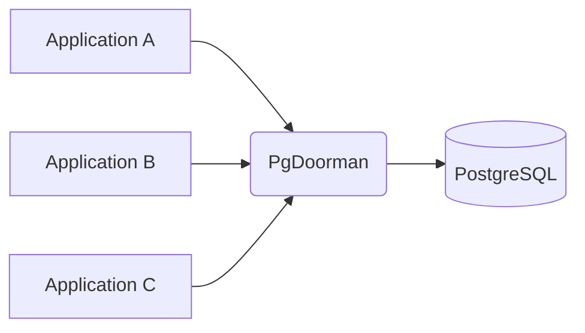

# PgDoorman Overview

## What is PgDoorman?

PgDoorman is a high-performance PostgreSQL connection pooler based on PgCat. It acts as a middleware between your applications and PostgreSQL servers, efficiently managing database connections to improve performance and resource utilization.



When an application connects to PgDoorman, it behaves exactly like a PostgreSQL server. Behind the scenes, PgDoorman either creates a new connection to the actual PostgreSQL server or reuses an existing connection from its pool, significantly reducing connection overhead.

## Key Benefits

- **Reduced Connection Overhead**: Minimizes the performance impact of establishing new database connections
- **Resource Optimization**: Limits the number of connections to your PostgreSQL server
- **Improved Scalability**: Allows more client applications to connect to your database
- **Connection Management**: Provides tools to monitor and manage database connections

## Pooling Modes

To maintain proper transaction semantics while providing efficient connection pooling, PgDoorman supports multiple pooling modes:

### Transaction Pooling

```admonish success title="Recommended for most use cases"
In transaction pooling mode, a client is assigned a server connection only for the duration of a transaction. Once the transaction ends, the connection is released back into the pool.
```

- **High Efficiency**: Connections are shared between clients, allowing thousands of clients to share a small pool.
- **Ideal for**: Applications with many short-lived connections or those that don't rely on session state.

### Session Pooling

```admonish info title="Useful for specific legacy needs"
In session pooling mode, each client is assigned a dedicated server connection for the entire duration of the client connection.
```

- **Exclusive Allocation**: The connection remains exclusively allocated to that client until disconnection.
- **Support for Session Features**: Ideal for applications that rely on temporary tables or session variables.

## Administration

PgDoorman provides comprehensive tools for monitoring and management:

- **Admin Console**: A PostgreSQL-compatible interface for viewing statistics and managing the pooler
- **Configuration Options**: Extensive settings to customize behavior for your specific needs
- **Monitoring**: Detailed metrics about connection usage and performance

For detailed information on managing PgDoorman, see the [Admin Console documentation](./basic-usage.md#admin-console).
