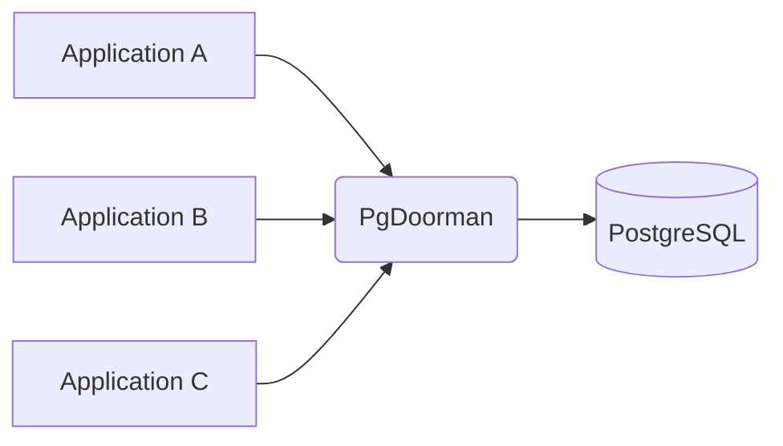

# Overview

## What PgDoorman does

PgDoorman sits between your applications and PostgreSQL. To the application it looks like a PostgreSQL server (same wire protocol, same `psql` connect string); under the hood it multiplexes many client sessions onto a much smaller set of real backend connections.


```mermaid
graph LR
    App1[Application A] --> Pooler(PgDoorman)
    App2[Application B] --> Pooler
    App3[Application C] --> Pooler
    Pooler --> DB[(PostgreSQL)]
```

PgDoorman was originally forked from [PgCat](https://github.com/postgresml/pgcat) but has since been rewritten around different goals: prepared statements in transaction mode, multi-threaded shared pools, Patroni integration, and binary upgrades that migrate live sessions. It is now a separate codebase.

## Why a pooler at all

Each PostgreSQL connection costs the server roughly 10 MB of RAM, a process, and time on every handshake (auth, SCRAM, search_path resolution). Without a pooler, an application that opens N short-lived connections per second pays N×handshake-time. A pooler lets the same N clients reuse a small set of long-lived backend connections, so the handshake cost is paid once per backend instead of once per client.

Concrete impact:

- A `pool_size` of 40 typically serves several thousand client sessions for short OLTP transactions.
- PostgreSQL avoids the per-process memory overhead of the connections it would otherwise have to keep open.
- Failover, restart, or rolling deployments don't translate into a thundering herd of fresh handshakes.

## Pool modes

```admonish success title="Transaction (recommended)"
The backend connection is held for the duration of one transaction and returned to the pool on `COMMIT` or `ROLLBACK`. This is the mode where pooling actually pays off.
```

```admonish info title="Session"
The backend connection is held for the entire client session and returned only when the client disconnects. Use this for clients that depend on session-scoped state (`SET TIME ZONE` outside a transaction, advisory locks across transactions, `WITH HOLD` cursors).
```

PgDoorman does not implement statement mode. See [Pool Modes](../concepts/pool-modes.md) for the exact contract of each mode and what works in transaction mode that doesn't work in other poolers.

## Operations surface

- **Admin console** — a PostgreSQL-compatible endpoint for `SHOW POOLS`, `SHOW CLIENTS`, `RELOAD`, `PAUSE`, `UPGRADE`, etc.
- **Prometheus `/metrics`** — built-in HTTP endpoint with per-pool latency percentiles, prepared-statement counters, fallback state, and TLS metrics.
- **`pg_doorman -t`** — validate the config without starting the server.
- **`pg_doorman generate --host …`** — emit a starter config by introspecting an existing PostgreSQL.

See [Admin commands](../observability/admin-commands.md) and [Prometheus reference](../reference/prometheus.md).

## Where to go next

- [Installation](installation.md) — install pg_doorman from packages, source, or Docker.
- [Basic usage](basic-usage.md) — minimal config, first connection, common gotchas.
- [Pool Coordinator](../concepts/pool-coordinator.md) — when one database is shared between several user-pools.
- [Binary upgrade](binary-upgrade.md) — replace the binary in production without dropping live sessions.
