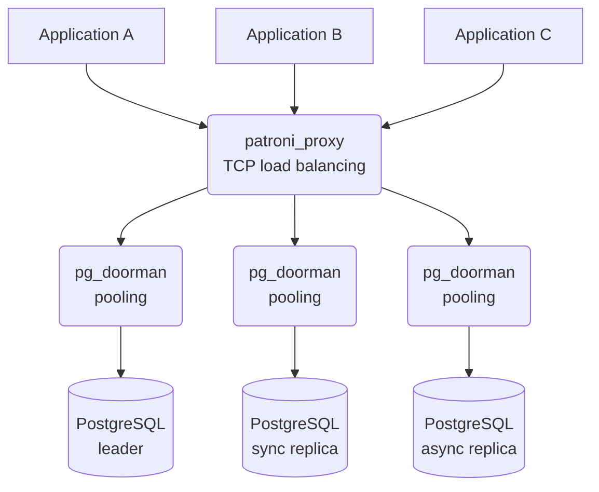

# Patroni Proxy

`patroni_proxy` is a specialized high-performance TCP proxy for Patroni-managed PostgreSQL clusters. Following the Unix philosophy of "do one thing and do it well", it focuses exclusively on TCP load balancing and failover for Patroni clusters.

## Overview

Unlike traditional solutions like HAProxy, `patroni_proxy` provides seamless connection management without disrupting existing connections during cluster topology changes. When a new replica is added or removed, only the affected connections are handled — all other connections continue working without interruption.

## Key Features

### Zero-Downtime Connection Management

The main advantage over HAProxy is that `patroni_proxy` **does not terminate existing connections** when the upstream configuration changes. This is critical for long-running transactions and connection-heavy applications.

### Hot Upstream Updates

- Automatic discovery of cluster members via Patroni REST API (`/cluster` endpoint)
- Periodic polling with configurable interval (`cluster_update_interval`)
- Immediate updates via HTTP API (`/update_clusters` endpoint)
- Configuration reload via SIGHUP signal without restart

### Role-Based Routing

Route connections based on PostgreSQL node roles:

| Role | Description |
|------|-------------|
| `leader` | Primary/master node |
| `sync` | Synchronous standby replicas |
| `async` | Asynchronous replicas |
| `any` | Any available node |

### Intelligent Load Balancing

- **Least Connections** strategy for distributing connections across backends
- Connection counters are preserved during cluster updates
- Automatic exclusion of nodes with `noloadbalance` tag

### Replication Lag Awareness

- Configurable `max_lag_in_bytes` per port
- Automatic disconnection of clients when replica lag exceeds threshold
- Only affects replica connections (leader has no lag)

### Member State Filtering

- Only members with `state: "running"` are used as backends
- Members in `starting`, `stopped`, `crashed` states are automatically excluded
- Dynamic state changes are handled during periodic updates

## Recommended Deployment Architecture

For optimal performance, we recommend a two-tier architecture:



- **pg_doorman** should be deployed **close to PostgreSQL servers** — it handles connection pooling, prepared statement caching, and protocol-level optimizations that benefit from low latency to the database
- **patroni_proxy** should be deployed **close to application clients** — it handles TCP routing and failover, distributing connections across the cluster without the overhead of connection pooling

This separation allows each component to excel at its specific task while providing both high availability and optimal performance.

## Configuration

Example `patroni_proxy.yaml`:

```yaml
# Cluster update interval in seconds (default: 3)
cluster_update_interval: 3

# HTTP API listen address for health checks and manual updates (default: 127.0.0.1:8009)
listen_address: "127.0.0.1:8009"

clusters:
  my_cluster:
    # Patroni API endpoints (multiple for redundancy)
    hosts:
      - "http://192.168.1.1:8008"
      - "http://192.168.1.2:8008"
      - "http://192.168.1.3:8008"
    
    # Optional: TLS configuration for Patroni API
    # tls:
    #   ca_cert: "/path/to/ca.crt"
    #   client_cert: "/path/to/client.crt"
    #   client_key: "/path/to/client.key"
    #   skip_verify: false
    
    ports:
      # Primary/master connections
      master:
        listen: "0.0.0.0:6432"
        roles: ["leader"]
        host_port: 5432
      
      # Read-only connections to replicas
      replicas:
        listen: "0.0.0.0:6433"
        roles: ["sync", "async"]
        host_port: 5432
        max_lag_in_bytes: 16777216  # 16MB
```

### Configuration Options

| Option | Default | Description |
|--------|---------|-------------|
| `cluster_update_interval` | 3 | Interval in seconds between Patroni API polls |
| `listen_address` | 127.0.0.1:8009 | HTTP API listen address |
| `clusters.<name>.hosts` | - | List of Patroni API endpoints |
| `clusters.<name>.tls` | - | Optional TLS configuration for Patroni API |
| `clusters.<name>.ports.<name>.listen` | - | Listen address for this port |
| `clusters.<name>.ports.<name>.roles` | - | List of allowed roles |
| `clusters.<name>.ports.<name>.host_port` | - | PostgreSQL port on backend hosts |
| `clusters.<name>.ports.<name>.max_lag_in_bytes` | - | Maximum replication lag (optional) |

## Usage

### Starting patroni_proxy

```bash
# Start with configuration file
patroni_proxy /path/to/patroni_proxy.yaml

# With debug logging
RUST_LOG=debug patroni_proxy /path/to/patroni_proxy.yaml
```

### Configuration Reload

Reload configuration without restart (add/remove ports, update hosts):

```bash
kill -HUP $(pidof patroni_proxy)
```

### Manual Cluster Update

Trigger immediate update of all cluster members via HTTP API:

```bash
curl http://127.0.0.1:8009/update_clusters
```

## HTTP API

| Endpoint | Method | Description |
|----------|--------|-------------|
| `/update_clusters` | GET | Trigger immediate update of all cluster members |
| `/` | GET | Health check (returns "OK") |

## Comparison with HAProxy + confd

| Feature | patroni_proxy | HAProxy + confd |
|---------|---------------|-----------------|
| Connection preservation on update | ✅ Yes | ❌ No (reload drops connections) |
| Hot upstream updates | ✅ Native | ⚠️ Requires confd + reload |
| Replication lag awareness | ✅ Built-in | ⚠️ Requires custom checks |
| Configuration complexity | ✅ Single YAML | ❌ Multiple configs |
| Resource usage | ✅ Lightweight | ⚠️ HAProxy + confd processes |
| Role-based routing | ✅ Native | ⚠️ Requires custom templates |

## Building

```bash
# Build release binary
cargo build --release --bin patroni_proxy

# Run tests
cargo test --test patroni_proxy_bdd
```

## Troubleshooting

### No backends available

If you see warnings like `no backends available`, check:

1. Patroni API is accessible from patroni_proxy host
2. Cluster members have `state: "running"`
3. Roles in configuration match actual member roles
4. If using `max_lag_in_bytes`, check replica lag values

### Connection drops after update

This should not happen with patroni_proxy. If connections are being dropped:

1. Check if the backend host was actually removed from the cluster
2. Verify `max_lag_in_bytes` threshold is not being exceeded
3. Enable debug logging to see detailed connection lifecycle
