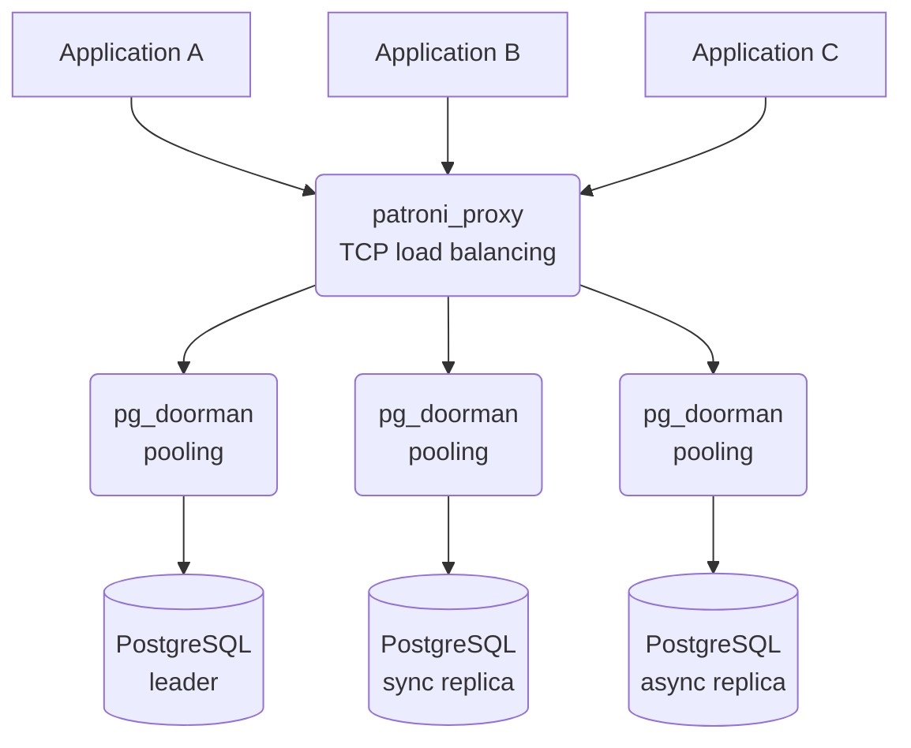

# Patroni Proxy

`patroni_proxy` is a TCP load balancer for Patroni-managed PostgreSQL clusters. It listens on one or more ports, asks the Patroni REST API who is leader / sync / async, and forwards new connections to the chosen role using least-connections balancing. It does not pool connections, parse the wire protocol, or know what SQL is being sent — that part is pg_doorman's job, deployed downstream of `patroni_proxy`.

## What it does

- **Discovers cluster members** by polling Patroni's `/cluster` endpoint at `cluster_update_interval` (default 3 s) and on demand via `GET /update_clusters`.
- **Routes by role.** Each listen port is bound to one or more roles (`leader`, `sync`, `async`, `any`). Connections to that port land on a member matching one of those roles.
- **Balances by least connections.** For ports bound to multiple eligible members, the proxy keeps a connection counter per member and picks the one with the fewest live connections. Counters survive cluster updates.
- **Drops replicas with stale data.** Per-port `max_lag_in_bytes` excludes members whose `replication_lag` (from `/cluster`) is over the threshold. Leader is never excluded by lag.
- **Skips members that aren't running.** Only `state: "running"` members are eligible; `starting`, `stopped`, `crashed`, and members with `noloadbalance` are filtered out.

The behaviour that matters operationally is what happens on a topology change: when a new member appears or an old one disappears, `patroni_proxy` updates its routing table for **future** connections only. Existing TCP connections to a still-running backend are not touched. Compared to HAProxy + confd, where a config reload tears down all connections that pass through the affected backend section, this means `cluster_update_interval` doesn't have to fight with long-running transactions.

### Roles

| Role | Description |
|------|-------------|
| `leader` | Primary / master node |
| `sync` | Synchronous standby replicas |
| `async` | Asynchronous replicas |
| `any` | Any running cluster member |

## Recommended deployment


```mermaid
graph TD
    App1[Application A] --> PP(patroni_proxy<br/>TCP load balancing)
    App2[Application B] --> PP
    App3[Application C] --> PP

    PP --> D1(pg_doorman<br/>pooling)
    PP --> D2(pg_doorman<br/>pooling)
    PP --> D3(pg_doorman<br/>pooling)

    D1 --> PG1[(PostgreSQL<br/>leader)]
    D2 --> PG2[(PostgreSQL<br/>sync replica)]
    D3 --> PG3[(PostgreSQL<br/>async replica)]
```

- **pg_doorman** lives on the PostgreSQL hosts. It does the pooling, prepared-statement cache, and protocol parsing — work that benefits from low latency to the local socket.
- **patroni_proxy** lives near the application. It routes TCP, owns the role-aware failover decision, and stays out of the pooler's way.

If the application traffic is small enough that one pg_doorman per cluster is sufficient, you can collapse the diagram and run pg_doorman directly with [Patroni-assisted fallback](patroni-assisted-fallback.md) and skip `patroni_proxy` entirely.

## Configuration

Example `patroni_proxy.yaml`:

```yaml
# Cluster update interval in seconds (default: 3)
cluster_update_interval: 3

# HTTP API listen address for health checks and manual updates (default: 127.0.0.1:8009)
listen_address: "127.0.0.1:8009"

clusters:
  my_cluster:
    # Patroni API endpoints (multiple for redundancy)
    hosts:
      - "http://192.168.1.1:8008"
      - "http://192.168.1.2:8008"
      - "http://192.168.1.3:8008"
    
    # Optional: TLS configuration for Patroni API
    # tls:
    #   ca_cert: "/path/to/ca.crt"
    #   client_cert: "/path/to/client.crt"
    #   client_key: "/path/to/client.key"
    #   skip_verify: false
    
    ports:
      # Primary/master connections
      master:
        listen: "0.0.0.0:6432"
        roles: ["leader"]
        host_port: 5432
      
      # Read-only connections to replicas
      replicas:
        listen: "0.0.0.0:6433"
        roles: ["sync", "async"]
        host_port: 5432
        max_lag_in_bytes: 16777216  # 16MB
```

### Configuration Options

| Option | Default | Description |
|--------|---------|-------------|
| `cluster_update_interval` | 3 | Interval in seconds between Patroni API polls |
| `listen_address` | 127.0.0.1:8009 | HTTP API listen address |
| `clusters.<name>.hosts` | - | List of Patroni API endpoints |
| `clusters.<name>.tls` | - | Optional TLS configuration for Patroni API |
| `clusters.<name>.ports.<name>.listen` | - | Listen address for this port |
| `clusters.<name>.ports.<name>.roles` | - | List of allowed roles |
| `clusters.<name>.ports.<name>.host_port` | - | PostgreSQL port on backend hosts |
| `clusters.<name>.ports.<name>.max_lag_in_bytes` | - | Maximum replication lag (optional) |

## Usage

### Starting patroni_proxy

```bash
# Start with configuration file
patroni_proxy /path/to/patroni_proxy.yaml

# With debug logging
RUST_LOG=debug patroni_proxy /path/to/patroni_proxy.yaml
```

### Configuration Reload

Reload configuration without restart (add/remove ports, update hosts):

```bash
kill -HUP $(pidof patroni_proxy)
```

### Manual Cluster Update

Trigger immediate update of all cluster members via HTTP API:

```bash
curl http://127.0.0.1:8009/update_clusters
```

## HTTP API

| Endpoint | Method | Description |
|----------|--------|-------------|
| `/update_clusters` | GET | Trigger immediate update of all cluster members |
| `/` | GET | Health check (returns "OK") |

## Comparison with HAProxy + confd

| Feature | patroni_proxy | HAProxy + confd |
|---------|---------------|-----------------|
| Connection preservation on update | ✅ Yes | ❌ No (reload drops connections) |
| Hot upstream updates | ✅ Native | ⚠️ Requires confd + reload |
| Replication lag awareness | ✅ Built-in | ⚠️ Requires custom checks |
| Configuration complexity | ✅ Single YAML | ❌ Multiple configs |
| Resource usage | ✅ Lightweight | ⚠️ HAProxy + confd processes |
| Role-based routing | ✅ Native | ⚠️ Requires custom templates |

## Building

```bash
# Build release binary
cargo build --release --bin patroni_proxy

# Run tests
cargo test --test patroni_proxy_bdd
```

## Troubleshooting

### No backends available

If you see warnings like `no backends available`, check:

1. Patroni API is accessible from patroni_proxy host
2. Cluster members have `state: "running"`
3. Roles in configuration match actual member roles
4. If using `max_lag_in_bytes`, check replica lag values

### Connection drops after update

This should not happen with patroni_proxy. If connections are being dropped:

1. Check if the backend host was actually removed from the cluster
2. Verify `max_lag_in_bytes` threshold is not being exceeded
3. Enable debug logging to see detailed connection lifecycle
