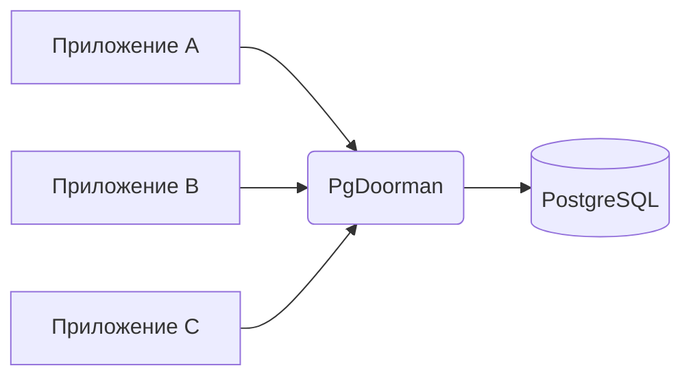

# Обзор PgDoorman

## Что такое PgDoorman?

PgDoorman — пулер соединений PostgreSQL на Rust. Изначально форк PgCat, теперь самостоятельный проект. Стоит между приложениями и PostgreSQL: переиспользует серверные соединения вместо того, чтобы открывать их под каждый клиентский запрос.



Когда приложение подключается к PgDoorman, тот ведёт себя ровно как сервер PostgreSQL. Внутри PgDoorman либо создаёт новое соединение к настоящему PostgreSQL, либо переиспользует существующее из своего пула, что значительно сокращает накладные расходы на установку соединений.

## Ключевые преимущества

- **Меньше накладных расходов на соединения**: снижается влияние установки новых соединений к базе на производительность.
- **Оптимизация ресурсов**: ограничивается число соединений к серверу PostgreSQL.
- **Улучшенная масштабируемость**: больше клиентских приложений могут подключаться к одной базе данных.
- **Управление соединениями**: инструменты для мониторинга и управления соединениями.

## Режимы пулинга

Чтобы сохранить корректную семантику транзакций при эффективном пулинге соединений, PgDoorman поддерживает несколько режимов:

### Транзакционный пулинг

```admonish success title="Рекомендуется для большинства сценариев"
В транзакционном режиме клиенту выдаётся серверное соединение только на время транзакции. Как только транзакция завершается, соединение возвращается в пул.
```

- Соединения переиспользуются между клиентами, поэтому пул из 40 backend-соединений обслуживает тысячи клиентов, пока транзакции короткие.
- Подходит большинству приложений, кроме тех, что полагаются на состояние сессии (`SET`, `WITH HOLD` курсоры, advisory-блокировки между транзакциями).

### Сессионный пулинг

```admonish info title="Полезно для специфических legacy-сценариев"
В сессионном режиме каждому клиенту выделяется собственное серверное соединение на всё время его клиентского соединения.
```

- **Эксклюзивное выделение**: соединение остаётся за клиентом до тех пор, пока тот не отключится.
- **Поддержка возможностей сессии**: подходит для приложений, использующих временные таблицы или переменные сессии.

## Администрирование

PgDoorman предоставляет полный набор инструментов для мониторинга и управления:

- **Admin-консоль**: PostgreSQL-совместимый интерфейс для просмотра статистики и управления пулером.
- **Параметры конфигурации**: широкие возможности настройки поведения под конкретные требования.
- **Мониторинг**: подробные метрики использования соединений и производительности.

Подробнее об управлении PgDoorman — см. [документацию admin-консоли](./basic-usage.md#Admin-консоль).
