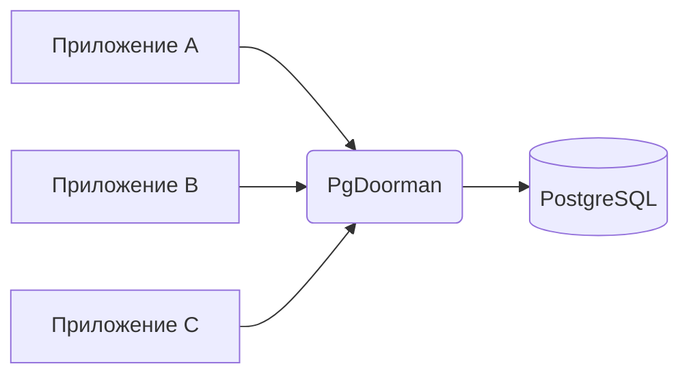

# Обзор

## Что делает PgDoorman

PgDoorman сидит между приложениями и PostgreSQL. Для приложения он выглядит как сервер PostgreSQL (тот же wire-протокол, та же строка подключения для `psql`); внутри он мультиплексирует много клиентских сессий на гораздо меньший набор реальных серверных соединений.



Изначально PgDoorman был форкнут из [PgCat](https://github.com/postgresml/pgcat), но с тех пор переписан вокруг других целей: prepared statements в transaction mode, многопоточные общие пулы, интеграция с Patroni и обновление бинаря с миграцией живых сессий. Сейчас это самостоятельная кодовая база.

## Зачем вообще пулер

Каждое соединение к PostgreSQL стоит серверу около 10 МБ RAM, отдельный процесс и время на каждый handshake (auth, SCRAM, разрешение `search_path`). Без пулера приложение, открывающее N короткоживущих соединений в секунду, платит N×время-handshake. Пулер позволяет тем же N клиентам переиспользовать небольшой набор долгоживущих серверных соединений, и стоимость handshake оплачивается один раз на соединение с PostgreSQL, а не один раз на клиента.

Конкретные эффекты:

- `pool_size` равный 40 обычно обслуживает несколько тысяч клиентских сессий для коротких OLTP-транзакций.
- PostgreSQL не платит per-process memory overhead за соединения, которые иначе пришлось бы держать открытыми.
- Failover, рестарт или rolling deploy не превращаются в лавину новых auth/SCRAM handshake-ов.

## Режимы пула

```admonish success title="Transaction (рекомендуется)"
Серверное соединение удерживается на время одной транзакции и возвращается в пул при `COMMIT` или `ROLLBACK`. Именно в этом режиме пулинг реально окупается.
```

```admonish info title="Session"
Серверное соединение удерживается на всё время клиентской сессии и возвращается только при отключении клиента. Используйте для клиентов, зависящих от состояния уровня сессии (`SET TIME ZONE` вне транзакции, advisory-блокировки между транзакциями, `WITH HOLD` курсоры).
```

PgDoorman не реализует statement mode. См. [режимы пула](../concepts/pool-modes.md) — точный контракт каждого режима и что работает в transaction mode у нас, чего нет у других пулеров.

## Что есть для эксплуатации

- **Консоль администратора** — PostgreSQL-совместимый эндпоинт для `SHOW POOLS`, `SHOW CLIENTS`, `RELOAD`, `PAUSE`, `UPGRADE` и т.д.
- **Prometheus `/metrics`** — встроенный HTTP-эндпоинт с per-pool latency-перцентилями, счётчиками prepared statements, состоянием fallback и метриками TLS.
- **Видимость prepared-кеша** — `SHOW INTERNER` и `SHOW POOLS_MEMORY` показывают объём интернера и клиентскую разбивку Named / Anonymous, с парными метриками в Prometheus.
- **`pg_doorman -t`** — валидация конфига без запуска сервера.
- **`pg_doorman generate --host …`** — собрать starter-конфиг через интроспекцию существующего PostgreSQL.

См. [команды администратора](../observability/admin-commands.md) и [Справочник Prometheus](../reference/prometheus.md).

## Куда дальше

- [Установка](installation.md) — установить pg_doorman из пакетов, исходников или Docker.
- [Базовое использование](basic-usage.md) — минимальный конфиг, первое подключение, типичные грабли.
- [Координатор пулов](../concepts/pool-coordinator.md) — когда одна база делится между несколькими пользовательскими пулами.
- [Плавное обновление бинаря](binary-upgrade.md) — заменить бинарник в промышленной эксплуатации без потери живых сессий.
