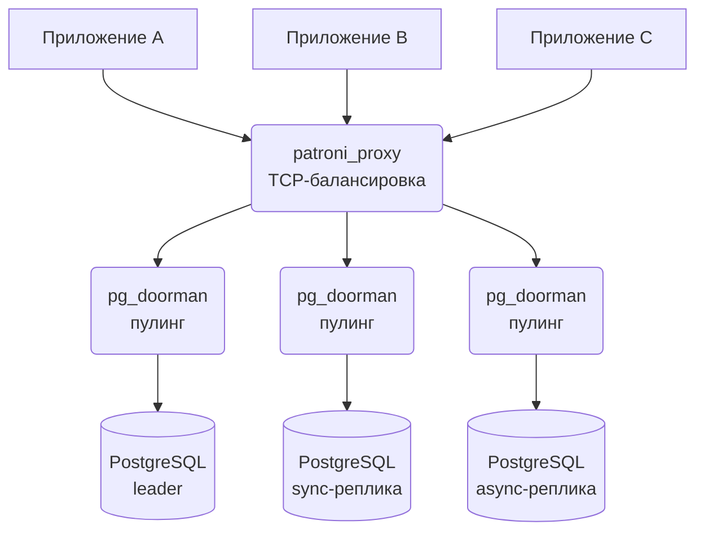

# Patroni Proxy

`patroni_proxy` — TCP-прокси для кластеров PostgreSQL под управлением Patroni. Делает одну вещь: балансирует TCP-соединения и обрабатывает failover в Patroni-кластере.

## Обзор

В отличие от HAProxy, `patroni_proxy` не рвёт существующие соединения при изменении топологии кластера. Когда реплика добавляется или удаляется, переключаются только затронутые соединения — остальные продолжают работать.

## Возможности

### Управление соединениями без простоя

`patroni_proxy` не разрывает существующие соединения при изменении upstream-конфигурации. Это важно для долгих транзакций и приложений с активным использованием connection pool.

### Hot-обновления upstream

- Автоматическое обнаружение членов кластера через Patroni REST API (endpoint `/cluster`).
- Периодический опрос с настраиваемым интервалом (`cluster_update_interval`).
- Немедленное обновление через HTTP API (endpoint `/update_clusters`).
- Перечитывание конфигурации сигналом SIGHUP без перезапуска.

### Маршрутизация по ролям

Маршрутизация соединений на основе ролей узлов PostgreSQL:

| Роль | Описание |
|------|----------|
| `leader` | Узел primary/master |
| `sync` | Синхронные standby-реплики |
| `async` | Асинхронные реплики |
| `any` | Любой доступный узел |

### Умная балансировка нагрузки

- Стратегия **Least Connections** для распределения соединений между бэкендами.
- Счётчики соединений сохраняются при обновлениях кластера.
- Автоматическое исключение узлов с тегом `noloadbalance`.

### Учёт лага репликации

- Настраиваемый `max_lag_in_bytes` для каждого порта.
- Автоматическое отключение клиентов, когда лаг реплики превышает порог.
- Влияет только на соединения к репликам (у leader лага нет).

### Фильтрация по состоянию members

- В качестве бэкендов используются только члены со `state: "running"`.
- Члены в состояниях `starting`, `stopped`, `crashed` автоматически исключаются.
- Динамические изменения состояния обрабатываются при периодических обновлениях.

## Рекомендуемая архитектура развёртывания

Двухслойная схема:



- **pg_doorman** разворачивается **рядом с серверами PostgreSQL** -- он обеспечивает пулинг соединений, кэширование prepared statements и оптимизации на уровне протокола, которым выгодна низкая задержка до базы.
- **patroni_proxy** разворачивается **рядом с клиентскими приложениями** -- он отвечает за TCP-маршрутизацию и failover, распределяя соединения по кластеру без накладных расходов пулинга.

Каждый компонент решает свою задачу: pg_doorman — пулинг и протокол, patroni_proxy — маршрутизация и failover.

## Конфигурация

Пример `patroni_proxy.yaml`:

```yaml
# Интервал обновления кластера в секундах (по умолчанию: 3)
cluster_update_interval: 3

# Адрес HTTP API для health checks и ручных обновлений (по умолчанию: 127.0.0.1:8009)
listen_address: "127.0.0.1:8009"

clusters:
  my_cluster:
    # Endpoint'ы Patroni API (несколько -- для отказоустойчивости)
    hosts:
      - "http://192.168.1.1:8008"
      - "http://192.168.1.2:8008"
      - "http://192.168.1.3:8008"
    
    # Опционально: TLS-конфигурация для Patroni API
    # tls:
    #   ca_cert: "/path/to/ca.crt"
    #   client_cert: "/path/to/client.crt"
    #   client_key: "/path/to/client.key"
    #   skip_verify: false
    
    ports:
      # Соединения к primary/master
      master:
        listen: "0.0.0.0:6432"
        roles: ["leader"]
        host_port: 5432
      
      # Read-only соединения к репликам
      replicas:
        listen: "0.0.0.0:6433"
        roles: ["sync", "async"]
        host_port: 5432
        max_lag_in_bytes: 16777216  # 16MB
```

### Параметры конфигурации

| Параметр | По умолчанию | Описание |
|----------|--------------|----------|
| `cluster_update_interval` | 3 | Интервал в секундах между опросами Patroni API |
| `listen_address` | 127.0.0.1:8009 | Адрес для HTTP API |
| `clusters.<name>.hosts` | -- | Список endpoint'ов Patroni API |
| `clusters.<name>.tls` | -- | Опциональная TLS-конфигурация для Patroni API |
| `clusters.<name>.ports.<name>.listen` | -- | Адрес для listener этого порта |
| `clusters.<name>.ports.<name>.roles` | -- | Список разрешённых ролей |
| `clusters.<name>.ports.<name>.host_port` | -- | Порт PostgreSQL на бэкенд-хостах |
| `clusters.<name>.ports.<name>.max_lag_in_bytes` | -- | Максимальный лаг репликации (опционально) |

## Использование

### Запуск patroni_proxy

```bash
# Запуск с файлом конфигурации
patroni_proxy /path/to/patroni_proxy.yaml

# С debug-логированием
RUST_LOG=debug patroni_proxy /path/to/patroni_proxy.yaml
```

### Перечитывание конфигурации

Перечитать конфигурацию без перезапуска (добавить или удалить порты, обновить hosts):

```bash
kill -HUP $(pidof patroni_proxy)
```

### Ручное обновление кластера

Запустить немедленное обновление всех членов кластера через HTTP API:

```bash
curl http://127.0.0.1:8009/update_clusters
```

## HTTP API

| Endpoint | Метод | Описание |
|----------|-------|----------|
| `/update_clusters` | GET | Запустить немедленное обновление всех членов кластера |
| `/` | GET | Health check (возвращает "OK") |

## Сравнение с HAProxy + confd

| Возможность | patroni_proxy | HAProxy + confd |
|-------------|---------------|-----------------|
| Сохранение соединений при обновлении | Да | Нет (reload разрывает соединения) |
| Hot-обновления upstream | Нативные | Требуется confd + reload |
| Учёт лага репликации | Встроен | Требуются кастомные проверки |
| Сложность конфигурации | Один YAML | Несколько конфигов |
| Потребление ресурсов | Лёгкий | Процессы HAProxy + confd |
| Маршрутизация по ролям | Нативная | Требуются кастомные шаблоны |

## Сборка

```bash
# Сборка release-бинарника
cargo build --release --bin patroni_proxy

# Запуск тестов
cargo test --test patroni_proxy_bdd
```

## Диагностика

### No backends available

Если видите предупреждения вроде `no backends available`, проверьте:

1. Patroni API доступен с хоста patroni_proxy.
2. У членов кластера `state: "running"`.
3. Роли в конфигурации совпадают с реальными ролями members.
4. Если используется `max_lag_in_bytes` -- проверьте текущий лаг реплик.

### Соединения разрываются после обновления

С patroni_proxy этого происходить не должно. Если соединения всё-таки разрываются:

1. Проверьте, действительно ли бэкенд-хост был удалён из кластера.
2. Убедитесь, что порог `max_lag_in_bytes` не превышается.
3. Включите debug-логирование, чтобы увидеть детальный жизненный цикл соединений.
